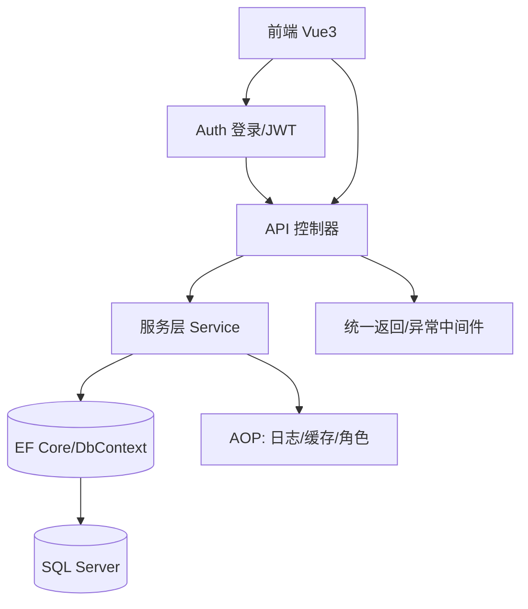

## 实训报告书

### 一、项目概述

- **项目名称**：中小型生产企业薪资管理系统（PayrollApi + PayrollWeb）
- **技术栈**：
  - 后端：ASP.NET Core Web API（.NET 9）、EF Core、SQL Server、Autofac + Castle DynamicProxy（AOP）、Serilog、Swagger/OpenAPI、JWT
  - 前端：Vue 3（Composition API）、Vite、Pinia、Vue Router、Axios、Element Plus、Tailwind CSS
- **运行端口**：后端 `http://localhost:5095`，前端 `http://localhost:5173`
- **数据库**：SQL Server（示例库名 `PayrollDb`）

本系统围绕“组织架构、人员信息、考勤、后勤与社保、薪资计算与发放、统计报表”展开，前后端分离，采用 JWT 鉴权与基于角色的权限控制（Admin/HR/User），以通用 CRUD + 领域服务的方式组织代码，通过 AOP 实现日志、缓存、角色校验三类横切关注点，保障在高可维护性的前提下具备良好性能和安全性。

---

### 二、系统分析

#### 2.1 系统提出与总体目标

在中小型制造与服务企业中，工资核算往往涉及多源数据与频繁变动：
- **人事维度**：部门、车间、员工入转离与基础信息维护；
- **考勤维度**：出勤、加班、缺勤、调休；
- **后勤与社保维度**：住宿与水电扣款、餐补发放、三金（养老、医疗、失业、公积金）缴纳；
- **薪资维度**：工资规则、明细项目管理、确认与发放流转；
- **统计维度**：按部门/车间/月度汇总与员工纵向历史查询。

系统的目标是：
- 建立统一的数据模型与标准化接口，避免表格散落、口径不一；
- 将“考勤/后勤/社保→薪资生成→确认→发放”的流程系统化；
- 提供基于角色的访问控制，满足“管理员/HR/普通员工”差异化权限；
- 降低薪资核算的人为错误，提升数据可追溯性与一致性。

#### 2.2 业务角色与权限

- **Admin（管理员）**：系统完全权限，包含敏感操作（删除、发放、配置等）。
- **HR（人力）**：人事、考勤、薪资生成与确认等核心业务（不含系统配置级权限）。
- **User（普通用户）**：以只读为主，可查看个人信息与记录。

后端通过 JWT 声明角色，前端在路由 `meta.roles` 与导航菜单处进行二次校验，做到前后端双保险。

#### 2.3 模块结构

- 组织管理：`Department / Workshop / Employee`
- 业务数据：`Attendance / LogisticsData / SocialSecurity`
- 薪资域：`Payroll / PayrollItem / SalaryChange / YearEndBonus`
- 报表域：汇总统计、个人历史查询
- 通用能力：统一返回、分页、异常处理、AOP 日志/缓存/角色校验、鉴权（JWT）



---

### 三、系统设计

#### 3.1 后端总体设计

- 分层结构清晰：Controller（接口）→ Service（业务）→ EF Core（数据）
- AOP 拦截：日志（LogInterceptor）、缓存（CacheInterceptor + [Cache]）、角色校验（AuthorizeRoleInterceptor + [AuthorizeRole]）
- 统一返回与异常：`ApiResponse<T>` 与全局 `ErrorHandlingMiddleware`
- 依赖注入：Autofac 容器 + 接口拦截；Swagger 暴露 API 文档；CORS 放行前端来源

关键的服务注册与拦截器启用（节选）：

```109:133:PayrollApi/Program.cs
builder.Host.ConfigureContainer<ContainerBuilder>(containerBuilder =>
{
	var assembly = Assembly.GetExecutingAssembly();

	// Interceptors
	containerBuilder.RegisterType<LogInterceptor>().SingleInstance();
	containerBuilder.RegisterType<CacheInterceptor>().SingleInstance();
	containerBuilder.RegisterType<AuthorizeRoleInterceptor>().SingleInstance();
	containerBuilder.RegisterType<CacheVersionProvider>().As<ICacheVersionProvider>().SingleInstance();

	// Services
	containerBuilder
		.RegisterAssemblyTypes(assembly)
		.Where(t => t.Name.EndsWith("Service") && !t.Namespace!.Contains("Interceptors"))
		.AsImplementedInterfaces()
		.InstancePerLifetimeScope()
		.EnableInterfaceInterceptors()
		.InterceptedBy(
			typeof(LogInterceptor),
			typeof(CacheInterceptor),
			typeof(AuthorizeRoleInterceptor)
		);

	containerBuilder.RegisterType<JwtService>().As<IJwtService>().SingleInstance();
});
```

#### 3.2 数据库设计

采用规范化设计，所有主数据表均具备审计字段（`CreatedAt/UpdatedAt/IsDeleted`），领域关联使用外键约束并通过索引优化查询。以工资单为例：

```111:139:PayrollApi/SQL/schema.sql
CREATE TABLE dbo.Payroll (
    PayrollId INT IDENTITY(1,1) PRIMARY KEY,
    EmployeeId INT NOT NULL,
    Month CHAR(7) NOT NULL,
    GrossAmount DECIMAL(18,2) NOT NULL DEFAULT 0,
    Deductions DECIMAL(18,2) NOT NULL DEFAULT 0,
    NetAmount DECIMAL(18,2) NOT NULL DEFAULT 0,
    Status TINYINT NOT NULL DEFAULT 0,
    CreatedAt DATETIME2 NOT NULL DEFAULT SYSUTCDATETIME(),
    UpdatedAt DATETIME2 NULL,
    IsDeleted BIT NOT NULL DEFAULT 0,
    CONSTRAINT FK_Payroll_Employee FOREIGN KEY (EmployeeId) REFERENCES dbo.Employee(EmployeeId) ON DELETE NO ACTION ON UPDATE CASCADE,
    CONSTRAINT UQ_Payroll_EmpMonth UNIQUE(EmployeeId, Month)
);
GO

CREATE TABLE dbo.PayrollItem (
    PayrollItemId INT IDENTITY(1,1) PRIMARY KEY,
    PayrollId INT NOT NULL,
    ItemType VARCHAR(30) NOT NULL,
    ItemName NVARCHAR(100) NOT NULL,
    Amount DECIMAL(18,2) NOT NULL,
    CreatedAt DATETIME2 NOT NULL DEFAULT SYSUTCDATETIME(),
    UpdatedAt DATETIME2 NULL,
    IsDeleted BIT NOT NULL DEFAULT 0,
    CONSTRAINT FK_PayrollItem_Payroll FOREIGN KEY (PayrollId) REFERENCES dbo.Payroll(PayrollId) ON DELETE CASCADE ON UPDATE CASCADE
);
GO
```

实体与 Fluent API 配置对齐，确保列类型、唯一索引与外键策略一致，软删除通过 `IsDeleted` 控制业务可见性。

#### 3.3 接口与统一返回设计

统一返回模型 `ApiResponse<T>` 保证前端消费一致性，分页参数/元信息通过 `PagedRequest/PaginationMeta` 承载：

```6:22:PayrollApi/Common/ApiResponse.cs
public class ApiResponse<T>
{
	[JsonPropertyName("success")] public bool Success { get; set; }
	[JsonPropertyName("message")] public string Message { get; set; } = "OK";
	[JsonPropertyName("data")] public T? Data { get; set; }
	[JsonPropertyName("meta")] public PaginationMeta? Meta { get; set; }

	public static ApiResponse<T> Ok(T? data, PaginationMeta? meta = null, string message = "OK")
	{
		return new ApiResponse<T> { Success = true, Message = message, Data = data, Meta = meta };
	}

	public static ApiResponse<T> Fail(string message)
	{
		return new ApiResponse<T> { Success = false, Message = message };
	}
}
```

异常统一由中间件拦截，业务错误与未知异常分开处理：

```18:38:PayrollApi/Controllers/ErrorHandlingMiddleware.cs
public async Task Invoke(HttpContext context)
{
	try
	{
		await _next(context);
	}
	catch (BusinessException bex)
	{
		context.Response.StatusCode = bex.StatusCode;
		context.Response.ContentType = "application/json";
		var payload = ApiResponse<object>.Fail(bex.Message);
		await context.Response.WriteAsync(JsonSerializer.Serialize(payload));
	}
	catch (Exception ex)
	{
		_logger.LogError(ex, "未处理的异常: {Message}", ex.Message);
		context.Response.StatusCode = (int)HttpStatusCode.InternalServerError;
		context.Response.ContentType = "application/json";
		var payload = ApiResponse<object>.Fail("服务器异常");
		await context.Response.WriteAsync(JsonSerializer.Serialize(payload));
	}
}
```

#### 3.4 安全与权限设计

- 后端采用 JWT 持票鉴权，令牌中承载用户标识与角色声明；
- 前端在路由守卫与菜单渲染处进行角色校验；
- 针对服务层敏感方法，使用 `[AuthorizeRole]` 注解由拦截器强制校验。

JWT 令牌生成（节选）：

```22:51:PayrollApi/Auth/JwtService.cs
public (string accessToken, DateTime expiresAt) GenerateToken(string userId, string userName, string[] roles, int? expireMinutes = null)
{
	var jwtSection = _configuration.GetSection("Jwt");
	var secret = jwtSection.GetValue<string>("Secret")!;
	var issuer = jwtSection.GetValue<string>("Issuer")!;
	var audience = jwtSection.GetValue<string>("Audience")!;
	var expire = TimeSpan.FromMinutes(expireMinutes ?? jwtSection.GetValue<int>("ExpireMinutes"));

	var claims = new List<Claim>
	{
		new Claim(JwtRegisteredClaimNames.Sub, userId),
		new Claim(JwtRegisteredClaimNames.UniqueName, userName),
		new Claim(ClaimTypes.NameIdentifier, userId),
		new Claim(ClaimTypes.Name, userName)
	};
	claims.AddRange(roles.Select(r => new Claim(ClaimTypes.Role, r)));

	var key = new SymmetricSecurityKey(Encoding.UTF8.GetBytes(secret));
	var creds = new SigningCredentials(key, SecurityAlgorithms.HmacSha256);
	var now = DateTime.UtcNow;
	var token = new JwtSecurityToken(
		issuer: issuer,
		audience: audience,
		claims: claims,
		notBefore: now,
		expires: now.Add(expire),
		signingCredentials: creds
	);
	var accessToken = new JwtSecurityTokenHandler().WriteToken(token);
	return (accessToken, token.ValidTo);
}
```

前端路由守卫（节选）：

```91:112:PayrollWeb/src/router/index.js
router.beforeEach((to, from, next) => {
  const userStore = useUserStore()
  
  if (to.meta.requiresAuth !== false && !userStore.isLoggedIn) {
    next('/login')
    return
  }
  
  if (to.name === 'Login' && userStore.isLoggedIn) {
    next('/')
    return
  }
  
  if (to.meta.roles && to.meta.roles.length > 0) {
    if (!userStore.hasAnyRole(to.meta.roles)) {
      ElMessage.error('您没有权限访问此页面')
      next('/')
      return
    }
  }
  
  next()
})
```

#### 3.5 缓存与日志（AOP）设计

- 读服务标注 `[Cache(60)]` 即可自动走 IMemoryCache；
- Key 由“类型+方法+序列化参数+版本号”组成，凡业务写入后调用 `ICacheVersionProvider.Bump` 提升版本，自动失效旧缓存；
- 统一日志包含方法、参数、耗时、异常，便于问题排查与性能分析。

缓存 Key 生成（节选）：

```55:67:PayrollApi/Interceptors/CacheInterceptor.cs
public static string BuildKey(IInvocation invocation, ICacheVersionProvider versionProvider)
{
	var method = $"{invocation.TargetType?.FullName}.{invocation.Method.Name}";
	
	// 过滤掉不可序列化的参数（如CancellationToken）
	var serializableArgs = invocation.Arguments
		.Where(arg => arg != null && IsSerializable(arg))
		.ToArray();
	
	var args = JsonSerializer.Serialize(serializableArgs);
	var ver = versionProvider.GetVersion(invocation.TargetType!);
	return CachePrefix + method + ":v" + ver + ":" + args;
}
```

拦截并缓存返回值（节选）：

```20:37:PayrollApi/Interceptors/CacheInterceptor.cs
public void Intercept(IInvocation invocation)
{
	var cacheAttr = (invocation.MethodInvocationTarget ?? invocation.Method)
		.GetCustomAttributes(typeof(CacheAttribute), true)
		.FirstOrDefault() as CacheAttribute;
	if (cacheAttr == null)
	{
		invocation.Proceed();
		return;
	}

	var key = BuildKey(invocation, _versionProvider);
	if (_cache.TryGetValue(key, out object? value))
	{
		Log.Debug("[CACHE] hit {Key}", key);
		invocation.ReturnValue = value;
		return;
	}
```

---

### 四、系统实现

#### 4.1 核心业务实现：薪资生成

系统以“员工当月考勤 + 后勤 + 社保”为基础，计算应发、扣款、实发，并落地工资明细项。计算规则（示例）：
- 基础时薪 = `BaseSalary / 21.75 / 8`
- 加班工资 = `Sum(OvertimeHours) * 基础时薪 * 加班倍率`
- 缺勤扣款 = `Sum(AbsentHours) * 基础时薪`
- 后勤与社保按月度聚合为正/负项

核心代码（节选）：

```78:116:PayrollApi/Services/Implementations/PayrollServices.cs
public async Task<IReadOnlyList<Payroll>> GenerateDraftsAsync(string month, int[]? employeeIds, decimal overtimeFactor, CancellationToken ct)
{
	await using var trx = await _db.Database.BeginTransactionAsync(ct);
	try
	{
		var employeesQuery = _db.Employees.Where(e => !e.IsDeleted && e.IsActive);
		if (employeeIds != null && employeeIds.Length > 0)
			employeesQuery = employeesQuery.Where(e => employeeIds.Contains(e.EmployeeId));
		var employees = await employeesQuery.ToListAsync(ct);

		var result = new List<Payroll>();
		foreach (var e in employees)
		{
			var exists = await _db.Payrolls.AnyAsync(p => p.EmployeeId == e.EmployeeId && p.Month == month && !p.IsDeleted, ct);
			if (exists) continue;

			var attendance = await _db.Attendances.Where(a => a.EmployeeId == e.EmployeeId && a.WorkDate.ToString()!.StartsWith(month) && !a.IsDeleted)
				.ToListAsync(ct);
			var overtimePay = attendance.Sum(a => a.OvertimeHours) * (e.BaseSalary / 21.75m / 8m) * overtimeFactor;
			var absentDeduction = attendance.Sum(a => a.AbsentHours) * (e.BaseSalary / 21.75m / 8m);

			var logistics = await _db.LogisticsData.FirstOrDefaultAsync(l => l.EmployeeId == e.EmployeeId && l.Month == month && !l.IsDeleted, ct);
			var social = await _db.SocialSecurities.FirstOrDefaultAsync(s => s.EmployeeId == e.EmployeeId && s.Month == month && !s.IsDeleted, ct);

			var payroll = new Payroll
			{
				EmployeeId = e.EmployeeId,
				Month = month,
				Status = PayrollStatus.Draft,
				GrossAmount = e.BaseSalary + overtimePay + (logistics?.MealAllowance ?? 0),
				Deductions = absentDeduction + (logistics?.HousingDeduction ?? 0) + (logistics?.UtilitiesDeduction ?? 0)
					+ (social?.Pension ?? 0) + (social?.Medical ?? 0) + (social?.Unemployment ?? 0) + (social?.HousingFund ?? 0),
			};
```

工资明细项生成（节选）：

```117:136:PayrollApi/Services/Implementations/PayrollServices.cs
			payroll.NetAmount = payroll.GrossAmount - payroll.Deductions;
			_db.Payrolls.Add(payroll);
			await _db.SaveChangesAsync(ct);

			var items = new List<PayrollItem>
			{
				new PayrollItem{ PayrollId = payroll.PayrollId, ItemType = "Fixed", ItemName = "BaseSalary", Amount = e.BaseSalary },
				new PayrollItem{ PayrollId = payroll.PayrollId, ItemType = "Attendance", ItemName = "Overtime", Amount = Math.Round(overtimePay,2) },
				new PayrollItem{ PayrollId = payroll.PayrollId, ItemType = "Attendance", ItemName = "AbsentDeduction", Amount = Math.Round(-absentDeduction,2) },
			};
			if (logistics != null)
			{
				items.Add(new PayrollItem{ PayrollId = payroll.PayrollId, ItemType = "Logistics", ItemName = "MealAllowance", Amount = logistics.MealAllowance });
				items.Add(new PayrollItem{ PayrollId = payroll.PayrollId, ItemType = "Logistics", ItemName = "HousingDeduction", Amount = -logistics.HousingDeduction });
				items.Add(new PayrollItem{ PayrollId = payroll.PayrollId, ItemType = "Logistics", ItemName = "UtilitiesDeduction", Amount = -logistics.UtilitiesDeduction });
			}
			if (social != null)
			{
				items.Add(new PayrollItem{ PayrollId = payroll.PayrollId, ItemType = "SocialSecurity", ItemName = "Pension", Amount = -social.Pension });
				items.Add(new PayrollItem{ PayrollId = payroll.PayrollId, ItemType = "SocialSecurity", ItemName = "Medical", Amount = -social.Medical });
				items.Add(new PayrollItem{ PayrollId = payroll.PayrollId, ItemType = "SocialSecurity", ItemName = "Unemployment", Amount = -social.Unemployment });
				items.Add(new PayrollItem{ PayrollId = payroll.PayrollId, ItemType = "SocialSecurity", ItemName = "HousingFund", Amount = -social.HousingFund });
			}
			_db.PayrollItems.AddRange(items);
			await _db.SaveChangesAsync(ct);
			_version.Bump(typeof(PayrollService));
			result.Add(payroll);
		}
```

#### 4.2 AOP 关键实现

- 日志拦截器记录调用链路、参数与耗时，发生异常时统一打点；
- 缓存拦截器以注解即插即用，避免在业务代码中显式耦合缓存逻辑；
- 角色拦截器以 `[AuthorizeRole]` 精确控制方法级权限，和 JWT/路由双向配合。

#### 4.3 前端实现要点

- 采用主布局 + 菜单自动生成，基于路由 `meta` 渲染标题与图标；
- 通用数据表 `DataTable` 抽象分页、排序、选择等交互；
- 工资单页面集成“生成、编辑、确认、发放、明细项管理”等业务操作；
- Pinia 管理鉴权状态，Axios 拦截统一附加 Token 与错误提示。

#### 4.4 系统物理配置说明

- 运行环境：
  - 后端：.NET 9 SDK、SQL Server（本地或容器）、Windows/macOS/Linux 均可；
  - 前端：Node.js ≥ 16、pnpm ≥ 8；
- 端口与跨域：
  - 后端默认 `http://localhost:5095`，CORS 放行 `http://localhost:5173`；
  - 前端开发端口 `5173`；
- 关键配置：
  - 连接串 `ConnectionStrings:Default`
  - JWT：`Jwt:Issuer/Audience/Secret/ExpireMinutes`
  - 日志：`Serilog:FilePath` 与 `MinimumLevel`

#### 4.5 系统使用说明

1) 初始化数据库（任选一种）：
   - 运行 `PayrollApi/SQL/schema.sql` 建库、建表并插入示例数据；
   - 开发环境可用 `PayrollApi/Controllers/DevController: POST /api/dev/reset-data` 进行一键重置并插入中文演示数据；
2) 启动后端：
   - 配置 `appsettings.json` 连接串指向 SQL Server；
   - `dotnet run`，访问 `http://localhost:5095/swagger`；
3) 启动前端：
   - `PayrollWeb` 目录运行 `pnpm install && pnpm dev`；
   - 在 `.env.local` 配置 `VITE_API_BASE=http://localhost:5095`；
4) 登录与体验：
   - 演示账号：`admin/admin123`、`hr/hr123`、`user/user123`；
   - 典型流程：部门/车间→员工→考勤/后勤/社保→生成工资单→确认→发放→查看报表。

---

### 五、心得体会

1) 分层与抽象的价值：
   通过“控制器—服务—EF Core”的分层，将职责边界清晰化；服务层聚焦业务规则，数据访问与缓存、日志等横切关注点统一抽离到 AOP，大幅降低了耦合度与重复代码量。

2) AOP 带来的工程化收益：
   基于 Autofac + Castle 动态代理，让“加缓存/打日志/做权限”变成在接口或方法上加注解的轻量操作，既符合开放封闭原则，又使得非功能性需求独立演化，维护成本低。

3) 缓存版本号策略：
   通过 `ICacheVersionProvider` 控制服务维度的缓存版本，写操作后“抬版本”天然驱逐旧缓存，避免了逐 key 失效的复杂度。对高读低写的列表查询尤其显著。

4) 统一返回与错误处理：
   统一模型降低了前端复杂度，错误中间件区分业务异常与系统异常，使错误语义更准确、问题定位更清晰。前端 Axios 拦截器进一步整合了 401 处理与消息提示，体验完整。

5) 薪资规则的可解释性：
   示例中选用“21.75×8”为折算基准，规则明确、可审计；工资项分解为固定/考勤/后勤/社保/其他，既便于溯源，又便于调整扩展（如增加绩效、提成等）。

6) 安全与权限防线：
   令牌角色 + 服务注解 + 路由守卫多层防护，既照顾易用性又保障了越权风险可控。后续可进一步接入更细粒度的资源级权限（RBAC/ABAC）。

7) 可扩展性与改进方向：
   - 数据导入/导出：当前已具备基础能力，可扩展导入模板、异步任务与校验报告；
   - 审批流：将“生成→确认→发放”引入可配置审批链；
   - 多组织与多账期：抽象租户与账期概念，支持集团化管理；
   - 性能：热点数据可引入分布式缓存（Redis），查询层引入只读副本或 CQRS；
   - 可观测：完善链路跟踪（OpenTelemetry）、指标与报警。

---

### 六、参考文献

- Microsoft Docs — ASP.NET Core:
  - 身份验证与授权（JWT、角色）
  - 中间件与依赖注入
  - EF Core（关系映射、迁移与性能）
- Autofac 官方文档：容器、拦截器与 AOP 实践
- Castle Project（DynamicProxy）：动态代理与拦截器用法
- Serilog 官方文档：结构化日志与 Sink 配置
- Swagger / OpenAPI 规范：API 文档与安全定义
- Vue 3 官方文档、Vue Router、Pinia、Element Plus、Axios 文档
- 《企业应用架构模式》、《Clean Architecture》

---

### 附录（选）常见问题与故障排查

- 后端 401：检查前端是否携带有效 Bearer Token，或令牌是否过期；
- 数据为空：确认数据库是否执行初始化脚本，或使用 Dev 接口重置数据；
- 跨域失败：检查后端 CORS 策略是否放行当前前端来源地址；
- 连接失败：确认 SQL Server 连接串、端口与防火墙配置；
- 性能慢：查看日志与 SQL 计划，适当增加索引/读写分离/启用分布式缓存；

（完）

